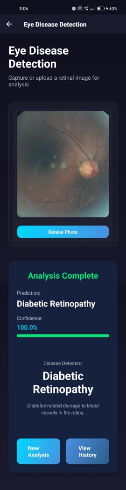
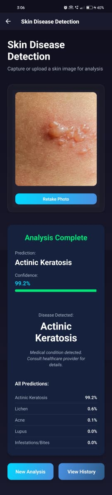
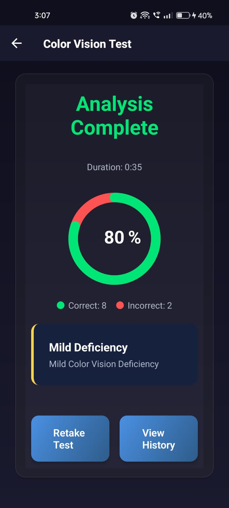

<h1 align="center">
  👁️ EyeDetect — Eye & Skin Disease Detection
</h1>

<p align="center">
  <strong>AI-powered Android app for early detection of eye diseases, skin conditions, and color vision deficiencies — fully on-device, offline, and privacy-first.</strong>
</p>

<p align="center">
  
  
  
  
  
</p>

---

## 📖 Table of Contents

- [Overview](#-overview)
- [Features](#-features)
- [Architecture](#-architecture)
- [App Screens](#-app-screens)
- [Disease Classes](#-disease-classes)
- [ML Models](#-ml-models)
- [Tech Stack](#-tech-stack)
- [Project Structure](#-project-structure)
- [Getting Started](#-getting-started)
- [Model Training](#-model-training)
- [How It Works](#-how-it-works)
- [Privacy & Offline](#-privacy--offline)
- [Disclaimer](#%EF%B8%8F-disclaimer)

---

## 🌟 Overview

**EyeDetect** is a React Native Android application that leverages on-device deep learning (TensorFlow Lite) to screen for:

- 👁️ **Eye diseases** from retinal/fundus images (Cataract, Diabetic Retinopathy, Glaucoma)
- 🩺 **Skin diseases** from skin photos (10 conditions including Melanoma, Eczema, BCC)
- 🎨 **Color vision deficiencies** via an interactive Ishihara plate test (Protan, Deutan, Tritan)

All inference runs **100% on-device** — no data is ever sent to a server. Results are stored locally in SQLite and users can review their full test history.

---

## ✨ Features

| Feature | Description |
|---|---|
| 👁️ Eye Disease Detection | Analyze retinal fundus images for Cataract, Diabetic Retinopathy, Glaucoma |
| 🩺 Skin Disease Detection | Classify 10 skin conditions from captured or uploaded photos |
| 🎨 Color Vision Test | Interactive Ishihara plate test with severity analysis |
| 📊 Test History | Persistent local history of all past tests via SQLite |
| 🛡️ Image Validation | Two-stage gate: domain classification + quality check before inference |
| 📴 Fully Offline | All ML inference runs on-device — no internet required |
| 🔒 Privacy-First | No images or results are ever uploaded to any server |
| 📱 Dark Theme UI | Modern dark UI with gradient cards and smooth transitions |

---

## 🏗️ Architecture

```
┌─────────────────────────────────────────────────┐
│                  React Native UI                │
│   HomeScreen │ EyeDetection │ SkinDetection     │
│   ColorVisionTest │ HistoryScreen               │
└──────────────────────┬──────────────────────────┘
                       │
           ┌───────────▼───────────┐
           │     Service Layer     │
           │  ModelService         │  ← Orchestrates inference
           │  TwoStageGateService  │  ← Validates input images
           │  DomainModelService   │  ← Domain classifier
           │  DatabaseService      │  ← SQLite persistence
           │  IshiharaTestService  │  ← Color vision logic
           └───────────┬───────────┘
                       │
        ┌──────────────▼─────────────┐
        │    TFLite Models (On-Device)│
        │  eye_disease_model.tflite  │
        │  skin_disease_model.tflite │
        │  fundus_classifier.tflite  │
        │  skin_classifier.tflite    │
        └────────────────────────────┘
```

### Two-Stage Validation Gate

Before running disease prediction, every image passes through a **two-stage gate**:

```
Image Input
    │
    ▼
[Stage 0] Domain Classifier
    └── Is this a relevant medical image? (fundus / skin)
    └── If NO → reject with "Non-medical image" warning
    │
    ▼
[Stage 1] Quality Check
    └── Is lighting, focus, and content adequate?
    └── If NO → reject with "Image quality issues" warning
    │
    ▼
[Stage 2] Disease Classifier
    └── Run TFLite inference → top prediction + confidence
    └── Save to SQLite if valid
```

---

## 📱 App Screens

### 🏠 Home Screen
- App entry point with gradient menu cards
- Navigates to Eye Detection, Skin Detection, Color Vision Test, History

### 👁️ Eye Disease Detection
<p align="center">
  
</p>

- Capture or upload a **retinal fundus** photograph
- Passes through 2-stage validation before inference
- Displays top prediction, confidence score, progress bar, and disease description
- Saves valid results to history

### 🩺 Skin Disease Detection
<p align="center">
  
</p>

- Capture or upload a **skin lesion** photograph
- Passes through 2-stage validation (domain classifier first)
- Shows top-5 predictions with confidence percentages
- Color-coded warnings for invalid/low-quality images

### 🎨 Color Vision Test
<p align="center">
  
</p>

- Interactive **Ishihara plate test** (10 plates per session)
- Enter the number you see in each plate
- Analyzes Protan / Deutan / Tritan deficiency scores
- Results shown with an SVG pie chart and severity level (Normal / Mild / Moderate / Severe)
- Session duration tracked and saved

### 📊 Test History
- Filterable list of all past tests
- View prediction, confidence, date, and test type

---

## 🦠 Disease Classes

### Eye Disease Detection
| Class | Description |
|---|---|
| **Normal** | No signs of eye disease detected |
| **Cataract** | Clouding of the eye's natural lens |
| **Diabetic Retinopathy** | Diabetes-related damage to retinal blood vessels |
| **Glaucoma** | Optic nerve damage from elevated eye pressure |

### Skin Disease Detection
| Class | Description |
|---|---|
| **Atopic Dermatitis** | Chronic inflammatory skin condition |
| **Basal Cell Carcinoma (BCC)** | Most common skin cancer, rarely metastasizes |
| **Benign Keratosis-like Lesions (BKL)** | Non-cancerous skin growths |
| **Eczema** | Inflammatory dry, itchy skin patches |
| **Melanocytic Nevi (NV)** | Common benign moles |
| **Melanoma** | Aggressive skin cancer, can spread to organs |
| **Psoriasis / Lichen Planus** | Autoimmune scaly skin condition |
| **Seborrheic Keratoses** | Non-cancerous skin growths |
| **Tinea / Ringworm / Candidiasis** | Fungal skin infections |
| **Warts / Molluscum** | Viral skin infections |

### Color Vision Deficiency Types
| Type | Description |
|---|---|
| **Protanopia / Protanomaly** | Red-green (red deficiency) |
| **Deuteranopia / Deuteranomaly** | Red-green (green deficiency) |
| **Tritanopia / Tritanomaly** | Blue-yellow deficiency |
| **Normal Vision** | No color deficiency detected |

---

## 🤖 ML Models

All models are bundled as `.tflite` files in `src/assets/models/`:

| Model File | Purpose | Input Size |
|---|---|---|
| `eyemodel_latestV5.tflite` | Eye disease classifier (4 classes) | 224×224 RGB |
| `skin_disease_model_v2.tflite` | Skin disease classifier (10 classes) | 224×224 RGB |
| `fundus_classifier2.tflite` | Eye domain validator | 224×224 RGB |
| `skin_classifier.tflite` | Skin domain validator | 224×224 RGB |

### Model Performance
- Eye disease model trained on fundus/retinal image datasets
- Skin model trained on HAM10000 + ISIC datasets (~97% validation accuracy)
- Domain classifiers prevent false positives from unrelated images

---

## 🛠️ Tech Stack

| Technology | Version | Purpose |
|---|---|---|
| React Native | 0.73.2 | Cross-platform mobile framework |
| react-native-fast-tflite | ^2.0.0 | Fast TFLite inference on Android |
| @tensorflow/tfjs | ^4.22.0 | TensorFlow.js utilities |
| @tensorflow/tfjs-react-native | ^1.0.0 | RN TF bridge |
| react-native-sqlite-storage | 6.0.1 | Local SQLite database |
| react-native-image-picker | 7.1.0 | Camera & gallery access |
| react-native-vision-camera | 3.6.17 | Advanced camera features |
| @react-navigation/native | ^6.1.9 | Screen navigation |
| @react-navigation/stack | ^6.3.20 | Stack navigation |
| react-native-linear-gradient | ^2.8.3 | UI gradient effects |
| react-native-svg | 14.1.0 | SVG charts (color vision test) |
| react-native-fs | ^2.20.0 | File system access |
| react-native-async-storage | ^1.24.0 | Async key-value storage |
| Python / TensorFlow | 2.x | Model training (offline) |

---

## 📁 Project Structure

```
androidtestcur/
├── App.jsx                          # Root app with navigation stack
├── index.js                         # Entry point
├── app.json                         # App configuration
├── package.json                     # Dependencies
├── babel.config.js                  # Babel config
├── metro.config.js                  # Metro bundler config
│
├── src/
│   ├── screens/
│   │   ├── HomeScreen.jsx           # Main menu / landing screen
│   │   ├── EyeDetectionScreen.jsx   # Eye disease detection screen
│   │   ├── SkinDetectionScreen.jsx  # Skin disease detection screen
│   │   ├── ColorVisionTestScreen.jsx# Ishihara color vision test
│   │   └── HistoryScreen.jsx        # Test history viewer
│   │
│   ├── components/
│   │   ├── common/
│   │   │   ├── Card.jsx             # Reusable card component
│   │   │   └── Button.jsx           # Reusable button component
│   │   └── detection/
│   │       └── ImageCapture.jsx     # Camera / gallery image picker
│   │
│   ├── services/
│   │   ├── tflite/
│   │   │   ├── ModelService.js      # Main inference orchestrator
│   │   │   ├── TwoStageGateService.js # Two-stage image validation
│   │   │   ├── DomainModelService.js  # Domain classification
│   │   │   └── DomainClassifierService.js
│   │   ├── database/
│   │   │   ├── DatabaseService.js   # SQLite CRUD operations
│   │   │   └── schema.js            # DB table definitions
│   │   └── colortest/
│   │       └── IshiharaTestService.js # Ishihara test logic & analysis
│   │
│   ├── assets/
│   │   ├── models/                  # TFLite model files
│   │   │   ├── eyemodel_latestV5.tflite
│   │   │   ├── skin_disease_model_v2.tflite
│   │   │   ├── fundus_classifier2.tflite
│   │   │   └── skin_classifier.tflite
│   │   └── ishihara/                # Ishihara plate images
│   │
│   ├── styles/
│   │   ├── theme.js                 # Colors, spacing, typography
│   │   └── globalStyles.js          # Shared style objects
│   │
│   └── utils/
│       └── constants.js             # TEST_TYPES and app constants
│
├── android/                         # Native Android project
│
├── fine_tune_eye_model.py           # Python script: fine-tune eye model
├── fine_tune_colab.py               # Python script: Colab training
├── skindisease97perncetangemodel.py # Python script: skin model training
├── skin_classifier_colab_code.txt   # Skin classifier training reference
└── requirements_training.txt        # Python training dependencies
```

---

## 🚀 Getting Started

### Prerequisites

- **Node.js** ≥ 18
- **Android Studio** (with Android SDK)
- **JDK 17**
- **React Native CLI**
- An Android device or emulator (API 24+)

### Installation

1. **Clone the repository**
   ```bash
   git clone https://github.com/gauthamkt/eye-skin_disease_detection.git
   cd eye-skin_disease_detection
   ```

2. **Install JavaScript dependencies**
   ```bash
   npm install
   ```

3. **Configure Android environment**
   
   Create `android/local.properties` and add your SDK path:
   ```
   sdk.dir=C\:\\Users\\YourUser\\AppData\\Local\\Android\\Sdk
   ```

4. **Start Metro bundler**
   ```bash
   npm start
   ```

5. **Run on Android**
   ```bash
   npm run android
   ```

### Quick Install (Pre-built APK)

A debug APK is available for direct installation on Android devices:

> Download `EyeDetect-debug.apk` and install with **"Install from unknown sources"** enabled.

---

## 🧠 Model Training

The Python training scripts are provided to reproduce or extend the models:

### Eye Disease Model (`fine_tune_eye_model.py`)
Fine-tunes an existing Keras eye disease model to add **non-fundus rejection** capability using transfer learning.

```bash
pip install -r requirements_training.txt
python fine_tune_eye_model.py
```

- Adds a `Non-Fundus` class to reject irrelevant images
- Freezes early layers, fine-tunes last 10 layers
- Exports to `.tflite` with default optimization

### Skin Disease Model (`skindisease97perncetangemodel.py`)
Full training pipeline for the 10-class skin disease classifier.

```bash
python skindisease97perncetangemodel.py
```

- Trained on HAM10000 + ISIC dataset
- Achieves ~97% validation accuracy
- Exports optimized TFLite model

### Google Colab Training (`fine_tune_colab.py`)
GPU-accelerated training script compatible with Google Colab.

### Training Requirements
```
tensorflow>=2.x
numpy
scikit-learn
matplotlib
seaborn
Pillow
```

Install with:
```bash
pip install -r requirements_training.txt
```

---

## ⚙️ How It Works

### Image Analysis Flow

```
1. User selects/captures image
         ↓
2. Two-Stage Validation Gate
   ├── Stage 0: Domain classifier checks if image is medical (fundus/skin)
   ├── Stage 1: Quality assessment (lighting, focus, content)
   └── Invalid → show colored warning (orange=wrong domain, blue=quality, red=content)
         ↓
3. TFLite Disease Model Inference
   └── Input: 224×224 resized, normalized image
   └── Output: probability vector over all disease classes
         ↓
4. Result Presentation
   ├── Top prediction with confidence score
   ├── Visual confidence bar
   ├── Disease description
   └── Top-5 predictions list
         ↓
5. Save to SQLite (only for valid results)
```

### Color Vision Test Flow

```
1. Generate randomized Ishihara plate sequence (10 plates)
2. User views each plate and enters the number they see
3. Answers scored as correct/incorrect
4. Protan / Deutan / Tritan scores computed
5. Deficiency type and severity (Normal/Mild/Moderate/Severe) determined
6. Results displayed with SVG pie chart
7. Saved to test history
```

---

## 🔒 Privacy & Offline

- ✅ **All inference runs on-device** using TFLite
- ✅ **No internet permission** required for core features
- ✅ **No images uploaded** to any cloud service
- ✅ **Local SQLite** database stores only prediction labels & confidence scores
- ✅ **Works fully offline** after installation

---

## ⚠️ Disclaimer

> **This application is for educational and screening purposes only.**
>
> EyeDetect is **not a medical device** and is **not FDA/CE approved**. Results should never be used as a substitute for professional medical advice, diagnosis, or treatment. Always consult a qualified healthcare professional for any medical concerns.
>
> The AI models may produce incorrect results. Accuracy depends on image quality and is not guaranteed.

---

## 📄 License

This project is licensed under the **MIT License** — see the [LICENSE](LICENSE) file for details.

---

## 👤 Author

**Gautham KT**  
Eye & Skin Disease Detection  
GitHub: [@gauthamkt](https://github.com/gauthamkt)

---

<p align="center">
  Made with ❤️ using React Native & TensorFlow Lite
</p>
